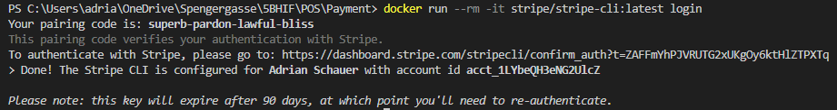
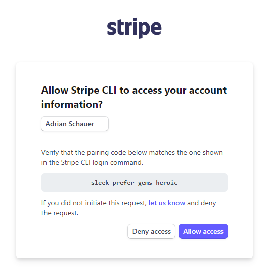
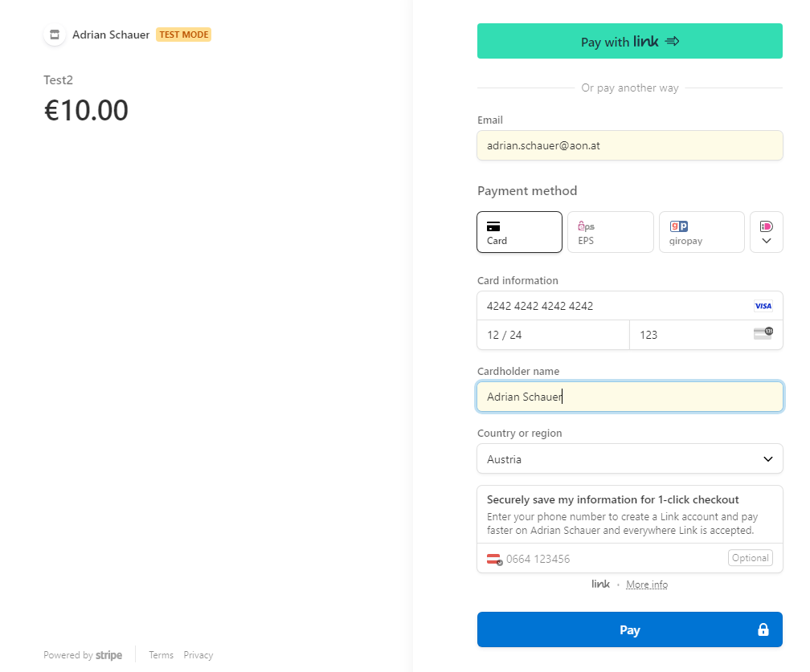
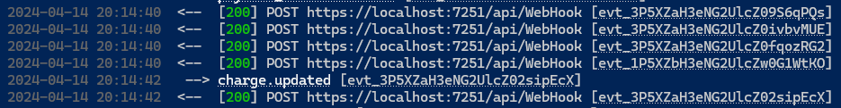

# Payment

## Mitglieder

- Adrian Schauer
- Lindor Limani
- Fabian Lasser

## Beschreibung

Im Teil Payment kümmern wir uns darum, dass die Zahlung des Kunden abgewickelt wird. Dazu wird eine Verbindung zu einem Payment-Service aufgebaut, der die Zahlung abwickelt. Der Payment-Service ist Stripe. Die Verbindung wird über eine REST-Schnittstelle aufgebaut. Die Daten werden in MongoDB gespeichert

## Projekt

Das ganze Projekt kann man sehen unter:
<https://github.com/SJ2324-5BHIF-Vogi>

### Stripe

#### Docs

Cards to use:
<https://docs.stripe.com/testing>

Login to Dashboard:
<https://dashboard.stripe.com/login>

WebHooks:
<https://docs.stripe.com/webhooks>
<https://docs.stripe.com/webhooks/quickstart?lang=dotnet>

CLI:
<https://docs.stripe.com/stripe-cli>

#### Installation

```bash
# Install the Stripe CLI for local webhook testing
docker run -p 3001:3001 -it stripe/stripe-cli:latest listen --forward-to 0.0.0.0:7251/api/WebHook
```




#### Webhook

```bash
# Forward the webhook to the local server
stripe listen --forward-to https://localhost:7251/api/WebHook #https cus stripe will not work with http only
# Copy the webhook secret
```

#### Payment Creation



